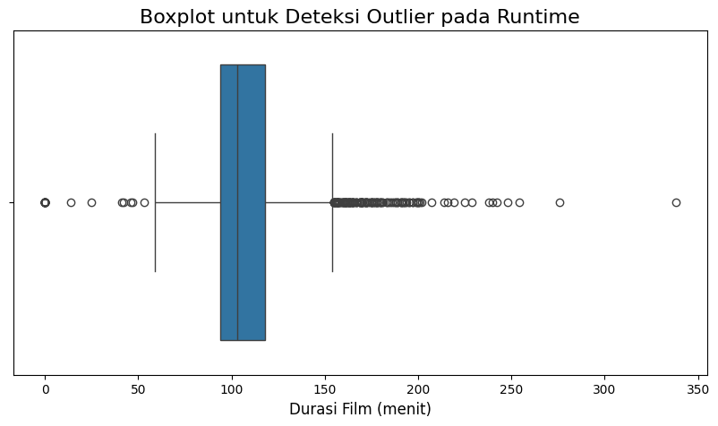

# Laporan Proyek Machine Learning - Sistem Rekomendasi Film
Syakib Binnur

---
## Project Overview

Seiring dengan pesatnya perkembangan teknologi digital, platform *streaming* film seperti Netflix, Disney+, dan lainnya telah menjadi sumber hiburan utama bagi jutaan orang di seluruh dunia. Platform ini menyediakan katalog berisi ribuan hingga puluhan ribu judul film dan serial TV, yang ironisnya dapat menimbulkan masalah baru bagi pengguna: *paradox of choice* atau kebingungan dalam memilih tontonan. Ketika dihadapkan pada terlalu banyak pilihan, pengguna sering kali kesulitan untuk memutuskan apa yang akan ditonton, yang dapat mengurangi kepuasan dan pengalaman mereka.

Untuk mengatasi masalah ini, sistem rekomendasi menjadi komponen krusial yang tidak terpisahkan dari layanan *streaming*. Sistem ini bertujuan untuk mempersonalisasi pengalaman pengguna dengan menyarankan konten yang paling relevan bagi setiap individu. Pentingnya sistem rekomendasi ini telah terbukti secara bisnis. Sebagai contoh, penelitian yang dipublikasikan oleh eksekutif Netflix, Carlos A. Gomez-Uribe dan Neil Hunt, menyatakan bahwa lebih dari 80% jam tayang di Netflix didorong oleh sistem rekomendasi mereka. Hal ini menunjukkan bahwa rekomendasi yang akurat dan relevan tidak hanya meningkatkan kepuasan pengguna tetapi juga secara langsung berkontribusi pada retensi pelanggan dan keberhasilan platform.

Proyek akhir ini bertujuan untuk merancang dan membangun model sistem rekomendasi film menggunakan dataset publik. Dengan menerapkan teknik *machine learning* yang telah dipelajari, proyek ini akan mengeksplorasi dua pendekatan utama dalam sistem rekomendasi untuk menghasilkan daftar tontonan yang dipersonalisasi. 

**Referensi:**
* Gomez-Uribe, C. A., & Hunt, N. (2016). The Netflix recommender system: Algorithms, business value, and innovation. *ACM Transactions on Management Information Systems (TMIS)*, 6(4), 1-19. Dapat diakses melalui: [ACM Digital Library](https://dl.acm.org/doi/10.1145/2843948)

---

## Business Understanding

Bagian ini menguraikan proses klarifikasi masalah, tujuan, dan pendekatan solusi yang akan diimplementasikan untuk proyek ini.

### Problem Statements

Berdasarkan latar belakang yang telah diuraikan, masalah utama yang akan diselesaikan adalah:
* Bagaimana cara membangun sistem yang dapat merekomendasikan film-film dengan konten yang serupa (misalnya, genre, alur cerita, atau pemeran yang sama) dengan film yang disukai pengguna?
* Bagaimana perbedaan teknik representasi fitur (vektorisasi teks) dapat memengaruhi kualitas dan karakteristik rekomendasi yang dihasilkan oleh model berbasis konten?

### Goals

Tujuan dari proyek ini adalah untuk menjawab pernyataan masalah di atas dengan:
* Menciptakan sebuah model sistem rekomendasi yang mampu memberikan rekomendasi film berdasarkan kemiripan konten dari metadata yang tersedia.
* Mengembangkan dan membandingkan dua model *Content-Based Filtering* yang menggunakan teknik vektorisasi berbeda (TF-IDF dan CountVectorizer) untuk memahami dampaknya terhadap hasil rekomendasi.

### Solution Approach
Untuk mencapai tujuan tersebut, proyek ini akan mengembangkan dan membandingkan dua model sistem rekomendasi dengan pendekatan *Content-Based Filtering*, namun menggunakan teknik representasi fitur yang berbeda:
1.  **Content-Based Filtering dengan TF-IDF**: Solusi pertama akan menganalisis metadata film dan menggunakan teknik TF-IDF untuk pembobotan fitur. Kemiripan antar film akan dihitung menggunakan *Cosine Similarity*.
2.  **Content-Based Filtering dengan CountVectorizer**: Solusi kedua akan menggunakan pendekatan yang sama, namun dengan teknik vektorisasi *CountVectorizer* (Bag of Words) sebagai pembanding untuk menganalisis dampaknya terhadap hasil rekomendasi.

---

## Data Understanding

Pada tahap ini, akan dilakukan eksplorasi mendalam terhadap dataset **TMDB 5000 Movie Dataset** untuk memahami karakteristik, distribusi, dan potensi pola yang ada di dalamnya.

**Sumber Dataset:** Dataset ini diperoleh dari platform Kaggle dan dapat diakses melalui tautan berikut: [TMDB 5000 Movie Dataset](https://www.kaggle.com/datasets/tmdb/tmdb-movie-metadata).

Dataset ini terdiri dari dua file CSV yang setelah digabungkan dan melalui proses pembersihan data awal menghasilkan sebuah DataFrame dengan **4803 baris data dan 23 kolom**. Dari inspeksi awal, diketahui bahwa beberapa kolom seperti `homepage` dan `tagline` memiliki banyak nilai yang hilang (*missing values*). Selain itu, kolom-kolom krusial seperti `genres`, `keywords`, `cast`, dan `crew` memiliki tipe data objek (string) yang berisi struktur JSON, yang memerlukan pemrosesan lebih lanjut.

### Deskripsi Variabel
Dataset gabungan yang digunakan memiliki 23 kolom (fitur). Berikut adalah deskripsi lengkap untuk setiap variabel:

* **`budget`**: Anggaran produksi film dalam Dolar AS (USD).
* **`genres`**: Daftar genre yang mengkategorikan film (misalnya, *Action*, *Comedy*, *Drama*). Data ini disimpan dalam format string JSON.
* **`homepage`**: URL ke situs web resmi film.
* **`id`**: Nomor identifikasi unik yang diberikan oleh TMDB untuk setiap film. Kolom ini digunakan sebagai kunci utama untuk menggabungkan dataset.
* **`keywords`**: Kata kunci atau tag yang terkait dengan plot, tema, atau latar film. Data ini juga disimpan dalam format string JSON.
* **`original_language`**: Kode dua huruf (misalnya, 'en' untuk Bahasa Inggris) yang menunjukkan bahasa asli film.
* **`original_title`**: Judul film dalam bahasa aslinya.
* **`overview`**: Sinopsis atau ringkasan singkat dari alur cerita film.
* **`popularity`**: Skor numerik yang dihitung oleh TMDB berdasarkan interaksi pengguna (seperti jumlah penonton, rating, dll.) yang menunjukkan tingkat popularitas film.
* **`production_companies`**: Daftar perusahaan produksi yang terlibat dalam pembuatan film. Disimpan dalam format string JSON.
* **`production_countries`**: Daftar negara tempat film diproduksi. Disimpan dalam format string JSON.
* **`release_date`**: Tanggal film pertama kali dirilis secara publik.
* **`revenue`**: Total pendapatan kotor (box office) yang dihasilkan film di seluruh dunia, dalam Dolar AS (USD).
* **`runtime`**: Durasi atau panjang film dalam satuan menit.
* **`spoken_languages`**: Daftar bahasa yang digunakan dalam dialog film. Disimpan dalam format string JSON.
* **`status`**: Status rilis film saat data diambil (misalnya, *Released*, *Post Production*).
* **`tagline`**: Slogan pemasaran atau frasa singkat yang digunakan untuk promosi film.
* **`title`**: Judul film yang umum digunakan (biasanya dalam Bahasa Inggris).
* **`vote_average`**: Rata-rata rating yang diberikan oleh pengguna, dengan skala dari 0 hingga 10.
* **`vote_count`**: Jumlah total pengguna yang telah memberikan rating untuk film tersebut.
* **`cast`**: Daftar pemeran utama yang membintangi film, termasuk nama karakter yang mereka perankan. Disimpan dalam format string JSON.
* **`crew`**: Daftar anggota kru kunci yang terlibat dalam produksi film, seperti sutradara, penulis skenario, dan produser. Disimpan dalam format string JSON.

---

## Exploratory Data Analysis (EDA)

#### Distribusi Genre Film

**Insight:** Dari visualisasi, terlihat bahwa genre **Drama** merupakan yang paling dominan, diikuti oleh **Comedy**, **Thriller**, dan **Action**. Hal ini mengindikasikan bahwa film dengan narasi kuat, elemen humor, atau ketegangan tinggi merupakan yang paling banyak diproduksi dalam dataset ini.

#### Distribusi Rating Film

**Insight:** Distribusi rating film cenderung miring ke kiri, dengan mayoritas film memiliki rating antara **6 hingga 7.5**. Sangat sedikit film yang mendapatkan rating sangat rendah atau sangat tinggi, yang merupakan pola umum pada data rating di mana kebanyakan item dinilai "cukup baik".

#### Kata Paling Umum dalam Sinopsis

**Insight:** Dari word cloud, kata-kata seperti 'life', 'love', 'find', 'world', 'man', dan 'family' terlihat dominan. Ini menandakan bahwa banyak film dalam dataset ini mengangkat tema universal seputar kehidupan, percintaan, pencarian jati diri, dan hubungan keluarga.

---

## Data Preparation

Pada tahap ini, dilakukan proses persiapan data untuk mengubah data mentah menjadi format yang bersih dan siap digunakan untuk pemodelan. Proses ini sangat penting untuk memastikan kualitas dan relevansi fitur yang akan diolah oleh model. Teknik-teknik yang diterapkan meliputi:

1.  **Penanganan Nilai yang Hilang**: Integritas data dipastikan dengan menghapus beberapa baris yang memiliki nilai hilang pada kolom esensial seperti `runtime` dan `release_date`. Mengingat jumlahnya yang sangat sedikit, pendekatan ini tidak mengurangi ukuran dataset secara signifikan. Selain itu, nilai yang hilang pada kolom `overview` diisi dengan string kosong untuk mencegah error pada tahap pemrosesan teks.

2.  **Rekayasa dan Ekstraksi Fitur**: Informasi relevan diekstrak dari kolom berformat JSON (`genres`, `keywords`, `cast`, dan `crew`). Untuk menjaga fokus pada fitur yang paling berpengaruh, ekstraksi dibatasi pada informasi kunci, seperti tiga nama pemeran utama dan nama sutradara. Langkah ini mengubah data tidak terstruktur menjadi fitur yang terstruktur dan bermakna.

3.  **Pembersihan dan Unifikasi Fitur**: Untuk memastikan setiap entitas (seperti nama orang atau genre multi-kata) diperlakukan sebagai satu token unik oleh model, spasi di dalamnya dihilangkan (contoh: 'Science Fiction' menjadi 'ScienceFiction'). Selanjutnya, semua fitur teks yang relevan—sinopsis, genre, kata kunci, pemeran, dan sutradara—digabungkan menjadi satu kolom komprehensif yang disebut `tags`. Kolom `tags` ini berfungsi sebagai representasi konten holistik untuk setiap film, yang akan menjadi dasar utama bagi model *Content-Based Filtering*.

Setelah melalui seluruh tahapan di atas, dataset kini telah siap untuk dilanjutkan ke proses pemodelan.

---

## Modeling and Result

Pada tahap ini, dilakukan pengembangan model sistem rekomendasi dengan pendekatan *Content-Based Filtering*. Pendekatan ini dipilih karena dapat memberikan rekomendasi berdasarkan atribut internal dari item (film) itu sendiri, seperti genre, sinopsis, dan pemeran. Dua variasi model dikembangkan untuk mengeksplorasi pengaruh teknik representasi fitur yang berbeda terhadap hasil rekomendasi.

### Model 1: Content-Based Filtering dengan TF-IDF
Model pertama memanfaatkan teknik TF-IDF (*Term Frequency-Inverse Document Frequency*) untuk proses vektorisasi.
- **Proses:** Kolom `tags` yang berisi gabungan semua fitur teks diubah menjadi matriks vektor numerik. TF-IDF memberikan bobot pada setiap kata berdasarkan frekuensinya dalam sebuah film dan keunikannya di seluruh koleksi film. Setelah itu, metrik *Cosine Similarity* digunakan untuk menghitung skor kemiripan antara setiap pasang vektor film.
- **Tujuan:** Model ini bertujuan menghasilkan rekomendasi berdasarkan kemiripan konten yang sudah dibobotkan, di mana kata-kata yang lebih spesifik dan unik memiliki pengaruh lebih besar.

### Model 2: Content-Based Filtering dengan CountVectorizer
Sebagai alternatif, model kedua dikembangkan menggunakan teknik *CountVectorizer* (atau *Bag of Words*).
- **Proses:** Sama seperti model pertama, kolom `tags` diubah menjadi matriks vektor. Namun, *CountVectorizer* hanya menghitung frekuensi kemunculan setiap kata tanpa mempertimbangkan bobot keunikannya. Matriks kemiripan kemudian dihitung menggunakan *Cosine Similarity*.
- **Tujuan:** Model ini diimplementasikan sebagai pembanding untuk menganalisis bagaimana representasi fitur yang lebih sederhana (hanya berdasarkan frekuensi) memengaruhi hasil akhir rekomendasi.

### Hasil Rekomendasi
Kedua model yang telah dibangun mampu menghasilkan daftar top-5 rekomendasi film berdasarkan judul film yang diberikan sebagai input. Berikut adalah contoh hasil perbandingan untuk film **'Spider-Man'**:

**Rekomendasi dari Model 1 (TF-IDF):**
1.  Spider-Man 3
2.  The Amazing Spider-Man
3.  The Amazing Spider-Man 2
4.  Spider-Man 2
5.  Arachnophobia

**Rekomendasi dari Model 2 (CountVectorizer / Bag of Words):**
1.  Kick-Ass
2.  The Amazing Spider-Man 2
3.  The Amazing Spider-Man
4.  The New Guy
5.  21 Jump Street

**Analisis Hasil:**
Kedua model memberikan hasil yang bagus dengan karakteristik yang berbeda. Model berbasis **TF-IDF** menunjukkan **presisi dan relevansi yang sangat tinggi**, dengan merekomendasikan film-film lain dalam waralaba Spider-Man. Ini sangat cocok untuk pengguna yang ingin mendapatkan rekomendasi yang sangat mirip. Di sisi lain, model berbasis **CountVectorizer** memberikan hasil yang lebih **beragam dan berpotensi mengejutkan (*serendipity*)**. Rekomendasi seperti 'Kick-Ass' (tema superhero remaja) dan '21 Jump Street' (tema kehidupan sekolah) menunjukkan kemampuan model untuk menangkap kesamaan konseptual yang lebih luas, tidak hanya kemiripan harfiah.

### Kelebihan dan Kekurangan Pendekatan
Pendekatan *Content-Based Filtering* yang digunakan dalam proyek ini memiliki beberapa kelebihan dan kekurangan sebagai berikut:

#### Kelebihan:
* **Tidak Memerlukan Data Pengguna Lain**: Model memberikan rekomendasi berdasarkan analisis konten item itu sendiri, sehingga efektif bahkan tanpa riwayat interaksi pengguna lain.
* **Mampu Merekomendasikan Item Spesifik (*Niche*)**: Jika seorang pengguna menyukai item yang tidak populer, model ini tetap dapat merekomendasikan item lain yang memiliki konten serupa.
* **Transparan dan Mudah Dijelaskan**: Rekomendasi yang diberikan dapat dijelaskan dengan mudah (misalnya, "Film ini direkomendasikan karena memiliki genre dan pemeran yang sama dengan film yang Anda sukai").

#### Kekurangan:
* **Terbatas pada Konten yang Sudah Ada**: Model ini cenderung merekomendasikan item yang sangat mirip dengan apa yang sudah disukai pengguna. Hal ini membatasi penemuan item baru yang berbeda genre atau tipe (*serendipity*) dan dapat menciptakan "filter bubble".
* **Ketergantungan pada Kualitas Fitur**: Kualitas rekomendasi sangat bergantung pada kelengkapan dan kualitas metadata yang digunakan. Jika fitur kontennya buruk, maka hasil rekomendasinya juga tidak akan akurat.
* **Masalah *Cold Start* untuk Pengguna Baru**: Model ini kesulitan memberikan rekomendasi kepada pengguna baru yang belum memiliki riwayat interaksi atau preferensi sama sekali.

---

## Evaluation

Evaluasi model dilakukan secara kuantitatif menggunakan metrik **Precision**. Metrik ini dipilih karena cocok untuk mengukur seberapa relevan rekomendasi yang diberikan dalam konteks *Content-Based Filtering*.

### Formula dan Cara Kerja
- **Formula:** `Precision = (Jumlah Film Rekomendasi yang Relevan) / (Jumlah Total Film yang Direkomendasikan)`
- **Definisi Relevan:** Dalam proyek ini, sebuah film rekomendasi dianggap "relevan" jika memiliki **setidaknya satu genre yang sama** dengan film acuan.

### Hasil Evaluasi
Evaluasi pada kasus uji film 'Spider-Man' (genre: *Fantasy, Action, Adventure*) menunjukkan hasil sebagai berikut:
- **Model 1 (TF-IDF):** Memperoleh nilai Precision @5 sebesar **0.80**.
- **Model 2 (CountVectorizer):** Juga memperoleh nilai Precision @5 sebesar **0.80**.

Nilai 0.80 ini berarti bahwa 4 dari 5 film yang direkomendasikan oleh masing-masing model terbukti relevan (memiliki genre yang sama). Hasil ini secara kuantitatif membuktikan bahwa kedua model mampu memberikan rekomendasi dengan tingkat presisi yang tinggi.

---
## Kesimpulan
Proyek ini telah berhasil mengembangkan sistem rekomendasi film menggunakan pendekatan *Content-Based Filtering* dengan dua teknik vektorisasi berbeda: TF-IDF dan CountVectorizer.

Berdasarkan hasil pemodelan dan evaluasi, dapat disimpulkan bahwa:
- Kedua model menunjukkan kinerja yang kuat dengan nilai presisi 80% pada kasus uji, yang membuktikan efektivitasnya dalam merekomendasikan film berdasarkan kemiripan konten.
- Rekayasa fitur yang cermat, terutama dalam pembuatan kolom `tags` yang komprehensif, memiliki dampak yang sangat signifikan terhadap hasil akhir, bahkan lebih besar daripada pilihan antara teknik vektorisasi TF-IDF dan CountVectorizer pada dataset ini.

Dengan demikian, tujuan proyek untuk menciptakan model yang mampu memberikan rekomendasi berdasarkan konten telah tercapai dengan baik.
